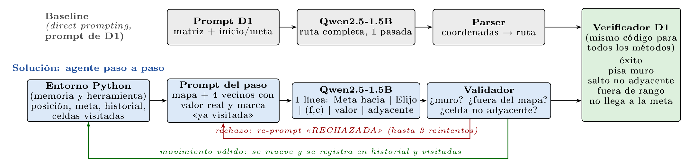

# Entregable 2
---

## 1. Qué hace este repositorio

Un modelo pequeño de pesos abiertos (**Qwen2.5-1.5B-Instruct**, ~1.5 B de parámetros) debe encontrar una ruta válida entre un punto de inicio y una meta en un laberinto de 9×9 (matriz con `0` = libre y `1` = muro).

Este repositorio compara, sobre **los mismos 20 laberintos** y con **el mismo verificador**:

| Método | Descripción |
|---|---|
| `baseline` | *Direct prompting*: el prompt del Entregable 1, que pide la ruta completa de una sola vez. |
| `agente` | **Solución**: el modelo decide **un paso a la vez**; el entorno valida cada paso y, si es inválido, lo rechaza y pide otro (hasta 3 reintentos por paso). Mantiene historial y marca celdas visitadas. |
| `agente_sin_memoria` | **Estrategia alternativa** (ablación): el mismo agente, pero sin historial ni marcas de celdas visitadas. |
| `aleatorio` | **Control**: política aleatoria sobre celdas libres, en el mismo entorno (sin modelo). |

Todo el código está en un único notebook: [`Entregable2_GenAI.ipynb`](./Entregable2_GenAI.ipynb).

---

## 2. Continuidad con el Entregable 1

**Tarea (Entregable 1, sección 1).** Agente de navegación sobre una matriz 9×9 (0 = camino, 1 = muro infranqueable). Entrada: matriz en texto, coordenadas de inicio y meta, movimiento ortogonal exclusivo. Salida: ruta secuencial en la que **cada paso declara** (i) la coordenada propuesta, (ii) el valor real de esa coordenada en la matriz y (iii) la validación lógica de adyacencia respecto al paso anterior.

**Fracaso inmediato (Entregable 1):** el agente pisa un muro, salta a una celda no adyacente, propone coordenadas fuera de rango o detiene la generación antes de llegar a la meta.

**Falla diagnosticada (Entregable 1, sección 2).** El *direct prompting* fracasa porque el modelo lee el laberinto como un flujo de texto unidimensional y genera de forma autorregresiva, sin memoria espacial ni mecanismo de búsqueda con retroceso (*backtracking*). Trata cada decisión como un evento aislado en lugar de integrar su historial de ruta. Se manifestó de dos formas:

1. **Alucinaciones de estado y violaciones físicas:** declarar valores de la matriz que no son los reales y atravesar muros para mantener una secuencia contigua. Con Qwen2.5-1.5B-Instruct se observó que atravesaba las paredes ignorando la física del mapa.
2. **Bucles:** revisitar la misma celda reiteradamente hasta agotar la generación (observados en AlphaMaze-v0.2-1.5B y Llama-3.1-8B-Instruct; la literatura citada en el Entregable 1 [MazeEval] atribuye la totalidad de los fallos de navegación por coordenadas a esta causa).

**Definición de respuesta correcta (idéntica a la del Entregable 1, aplicada a todos los métodos).** Implementada en `evaluar_ruta()`. Una ruta es correcta si, y solo si:
1. empieza en el inicio;
2. todas las celdas están dentro del rango 0–8;
3. ninguna celda es un muro;
4. cada par de celdas consecutivas es adyacente (Manhattan = 1, sin diagonales ni saltos);
5. llega a la meta.

**Relación intervención ↔ falla.** Cada componente de la solución ataca una parte concreta del diagnóstico:

| Diagnóstico del Entregable 1 | Intervención | Cómo se midió |
|---|---|---|
| Procesa el laberinto como flujo 1D; no integra el historial de ruta (decisiones aisladas) | **Descomposición en pasos** con historial de los últimos 8 pasos en el prompt | `agente` vs. `baseline` |
| Bucles por revisitar la misma celda | **Marcas de celdas ya visitadas** + instrucción de preferir celdas no visitadas | Ablación `agente_sin_memoria` |
| Sin *backtracking* (queda acorralado en callejones) | Instrucción explícita de retroceder si todas las celdas libres ya fueron visitadas | Casos de fallo (`analizar_fallo`) |
| Alucinación de estado (valores falsos) y atravesar muros | El entorno entrega el **valor real** de los 4 vecinos y **valida** cada propuesta (muro, borde, adyacencia); si es inválida la rechaza y el modelo reintenta | `invalidas`, `valor_mal_declarado`, `coordenada_mal_declarada`, `exito_estricto` |

Sobre el formato de salida de tres campos del Entregable 1: el modelo declara por paso `Meta hacia | Elijo | (fila, columna) | valor | adyacente`. Los campos (i) coordenada y (ii) valor **sí se contrastan** con la matriz; el campo (iii) adyacencia queda como plantilla fija «adyacente: sí», porque el entorno garantiza la adyacencia (ver desviación 3).

### Desviaciones respecto al Entregable 1 (declaradas)

1. **Más laberintos.** El Entregable 1 tenía un solo laberinto (inicio `(0,0)`, meta `(0,8)`). Aquí es el laberinto 0 del conjunto; los otros 19 son del mismo formato (9×9, `0/1`), generados con semilla fija (`seed_base=2026`): laberinto perfecto con 3 muros abiertos para crear caminos alternativos, e inicio/meta aleatorios a distancia mínima de 10 pasos.
2. **El agente recibe más información por paso que el baseline.** (Esto desplaza parte de la "alucinación de estado" diagnosticada al entorno: el valor de las celdas vecinas ya no lo infiere el modelo desde la matriz, sino que se le entrega.) Además del mapa completo, en cada paso recibe su posición, la meta, la dirección aproximada de la meta y los 4 movimientos posibles con el **valor real** de cada celda vecina (incluyendo muros y bordes, que **no se filtran**: evitarlos sigue siendo decisión del modelo). El baseline no recibe esta ayuda. Esto hace que la tarea sea más fácil para el agente que para el baseline, y por eso se reporta también el control aleatorio y la ablación sin memoria.
3. **Campo (iii) del Entregable 1 como plantilla.** El modelo escribe siempre «adyacente: sí»: el entorno solo ofrece movimientos ortogonales de una celda, así que ese campo no mide razonamiento. Los campos (i) coordenada y (ii) valor sí se contrastan con la matriz.
4. **Reintentos.** El agente puede reintentar un paso rechazado (hasta 3 veces); el baseline tiene una única pasada. Para medir el efecto, se reporta además `exito_estricto`: éxito **sin ninguna propuesta inválida**.

---

## 3. Modelo y hardware

| | |
|---|---|
| Modelo | `Qwen/Qwen2.5-1.5B-Instruct` (~1.5 B de parámetros) |
| Revisión fijada | `989aa7980e4cf806f80c7fef2b1adb7bc71aa306` |
| Precisión | `float16` (la T4 no soporta `bf16`) |
| Decodificación | *greedy* (`do_sample=False`) → resultados deterministas |
| Hardware | Google Colab (versión gratuita), GPU **NVIDIA Tesla T4**, 15 360 MiB de VRAM, igual al hardware declarado en el Entregable 1 |
| Software usado | `torch 2.11.0+cu128`, `transformers 5.16.1` |

**¿Por qué este modelo?** El Entregable 1 propuso tres candidatos:

| | Modelo 1 · AlphaMaze-v0.2-1.5B | **Modelo 2 · Qwen2.5-1.5B-Instruct (elegido)** | Modelo 3 · Llama-3.1-8B-Instruct |
|---|---|---|---|
| Parámetros | 1.5 B | **1.5 B** | 8 B |
| Rol en el Entregable 1 | Candidato objetivo (especializado) | Control de especialización | Control de escala |
| Entrada/salida | Tokens de pared por celda; solo emite tokens de movimiento → requiere adaptador a nuestro esquema 0/1 de tres campos | Acepta la matriz 0/1 y el formato de tres campos tal cual; buen seguimiento de instrucciones y salidas estructuradas | Acepta el formato tal cual |
| Falla observada en el Entregable 1 | Bucle autorregresivo reescribiendo fragmentos del prompt | Atraviesa muros para mantener secuencia contigua | Invierte valores de la matriz; agota la generación en verificación cíclica |
| VRAM en T4 | Holgado | Holgado | Ajustado (9 679 MiB de 15 360 MiB) |

Elegimos **Qwen2.5-1.5B-Instruct** porque:
- **Economía de parámetros:** es 5× menor que Llama-3.1-8B, que además ocupa ~63 % de la VRAM de la T4. Se prioriza resolver el fallo con un algoritmo (descomposición + validación) y no con escala de cómputo.
- Permite **resolver exactamente la tarea del Entregable 1** (matriz 0/1 con salida de tres campos) sin traducir el problema a otra representación. AlphaMaze ya viene entrenado en resolver laberintos: el problema se reduciría a adaptar el formato (laberinto → tokens de pared, salida → movimientos) y no a mejorar la navegación; además colapsó en bucles en nuestra evidencia del Entregable 1.
- Su falla diagnosticada (atravesar muros, inconsistencia coordenada/valor/adyacencia) es precisamente la que una intervención externa (descomposición + validación) puede atacar, y es la que se observa en el baseline de este entregable (20/20 rutas inválidas).

**Cambio declarado de rol:** en el Entregable 1 Qwen figuraba como *control de especialización* y AlphaMaze como candidato objetivo. En este entregable Qwen pasa a ser el modelo sobre el que se construye la solución. No se usa ningún modelo fuera de la lista del Entregable 1.

---

## 4. Pipeline



*Figura 1: Pipeline. El baseline genera la ruta completa de una vez; el agente decide un movimiento por paso y el entorno valida y recuerda. Ambos se miden con el mismo verificador. D1 = Entregable 1.* El código fuente de la figura está en [`figuras/pipeline.tex`](figuras/pipeline.tex) (versión vectorial: [`figuras/pipeline.pdf`](figuras/pipeline.pdf)).

Componentes principales del notebook:

- `generar_laberinto`, `construir_dataset` — generación reproducible de laberintos.
- `bfs` — camino óptimo (solo para medir eficiencia; **el modelo nunca lo ve**).
- `evaluar_ruta` — verificador único para todos los métodos.
- `prompt_baseline`, `correr_baseline`, `parsear_ruta_libre` — baseline.
- `prompt_paso`, `validar_propuesta`, `correr_agente` — solución (y ablación con `usar_memoria=False`).
- `correr_aleatorio` — control sin modelo.
- `dibujar`, `analizar_fallo` — visualización y diagnóstico de fallas.

### Versiones del agente evaluadas y descartadas

| Versión | Idea | Resultado observado (3 laberintos de prueba) |
|---|---|---|
| v1 | Pedir la coordenada de destino directamente | El modelo copiaba su posición actual y no avanzaba (3/3). |
| v2 | Opciones con letra A–D | Avanzaba, pero con sesgo hacia la opción C y bucles. |
| v3 | v2 + dirección de la meta | El sesgo hacia C se mantuvo. |
| v4 | v3 + razonamiento corto | Identificaba bien la dirección de la meta (3/3), pero no la traducía a la letra correcta y listaba muros como libres. |
| **v5 (actual)** | Elegir el movimiento **por nombre** (Arriba/Abajo/Izquierda/Derecha), con las mismas palabras que la dirección de la meta | Versión evaluada en el conjunto completo. |

---

## 5. Resultados (N = 20 laberintos 9×9, mismas entradas para todos los métodos)

| Método | Éxito | Éxito estricto (0 inválidas) | Pasos prom. | Propuestas inválidas prom. | Tiempo prom. (s) |
|---|---|---|---|---|---|
| Baseline (direct prompting) | **0 / 20** (0 %) | 0 / 20 | 1.75 | — | 36.9 |
| Agente paso a paso | **2 / 20** (10 %) | 0 / 20 | 10.40 | 10.15 | 27.9 |
| Agente sin memoria | 0 / 20 (0 %) | 0 / 20 | 81.00 | 34.00 | 154.4 |
| Aleatorio (sin modelo) | 5 / 20 (25 %) | 5 / 20 | 75.15 | 0 | 0.0 |

Desglose de estados finales:

| Método | éxito | pisa_muro | salto_no_adyacente | propuestas_invalidas | limite_pasos |
|---|---|---|---|---|---|
| Baseline | 0 | 14 | 6 | 0 | 0 |
| Agente | 2 | 0 | 0 | 17 | 1 |
| Agente sin memoria | 0 | 0 | 0 | 0 | 20 |
| Aleatorio | 5 | 0 | 0 | 0 | 15 |

**Lectura de los resultados:**

- El **control aleatorio (5/20) supera al agente (2/20)**. El aleatorio no es una política que un sistema real usaría (recorre hasta 81 pasos), pero indica que, en esta versión, el agente **no aprovecha de forma efectiva** la información que recibe.
- **Violaciones físicas (muros y saltos):** el baseline falla por ellas en 20/20. En el agente aparecen como 0, pero **por construcción** (el entorno bloquea esos movimientos), no porque el modelo las haya dejado de proponer: propuso en promedio 10.2 movimientos inválidos por laberinto y ninguna corrida terminó sin rechazos (estricto 0/20). Los ceros de las columnas `pisa_muro`/`salto_no_adyacente` del agente, de la ablación y del aleatorio no son evidencia de mejora.
- **Bucles:** la memoria los baja de 20/20 (sin memoria) a 1/20 (Fisher exacto, p ≈ 3·10⁻¹⁰). No se afirma que los elimine: 17 de 20 corridas del agente terminan antes (10.4 pasos en promedio) por rechazos agotados, así que no llegan a tener oportunidad de entrar en bucle.
- **Éxito:** 2/20 frente a 0/20 (Fisher p = 0.49; IC 95 % de Wilson para 2/20: 3–30 %) **no es concluyente**, y queda por debajo del control aleatorio (5/20).
- Cuando el agente tiene éxito lo hace con eficiencia 1.00 (pasos / óptimo), pero ninguno de esos 2 éxitos fue "estricto": ambos necesitaron reintentos.

---

## 6. Caso de falla y por qué ocurre

**Laberinto 1** (semilla 2027; inicio `(0,8)`, meta `(8,5)`; óptimo 11 pasos). El agente llega a `(2,8)` y emite 4 veces seguidas:

```
Derecha | (2, 7) | valor: 0 | adyacente: sí      -> rechazado: "Derecha está fuera del mapa"
```

**Por qué ocurre.**

1. **La coordenada es correcta, el nombre no.** `(2,7)` es la celda libre a la **izquierda** de `(2,8)`: el modelo ubica bien la celda, pero la nombra con la dirección equivocada. Como la decisión se toma por el **nombre** del movimiento (diseño v5), "Derecha" en la columna 8 cae fuera del mapa y se rechaza.
2. **Con decodificación *greedy*, reintentar no aporta información.** Tras un rechazo el prompt solo añade la marca `RECHAZADA` en una línea; la misma entrada produce la misma salida, y la corrida termina tras 2 pasos. (El laberinto 3 sí agota los 81 pasos.)
3. **Se repite en la demostración** (semilla 55409): el modelo escribe "Derecha" en 6 celdas consecutivas de la columna 8, aunque el prompt lista esa opción como "fuera del mapa".
4. **Es el modo dominante** (17 de 20 corridas del agente terminan por `propuestas_invalidas`; en promedio hay 0.95 casos por laberinto de coordenada declarada que no corresponde al movimiento). Un modelo de 1.5 B no mapea de forma fiable nombres de dirección a geometría de grilla, y el entorno **detecta** el error pero no lo **corrige**.

**Contraste con el diagnóstico del Entregable 1**

- *Se confirma:* el baseline falla escribiendo celdas que son muros (14/20) o saltos no adyacentes (6/20), y sin memoria el agente cae en bucles (20/20 agotan el límite de pasos). Ambos modos fueron predichos en el diagnóstico.
- *Se confirma parcialmente:* con historial y marcas de visitadas los bucles bajan de 20/20 a 1/20, pero no se puede afirmar que la memoria los elimine, porque 17/20 corridas terminan antes por rechazos agotados.
- *Aparece un modo no anticipado:* la falla dominante del agente (17/20) ya no es pisar muros ni revisitar celdas, sino **no mapear de forma fiable nombres de dirección a geometría de grilla** (nombra "Derecha" una celda que está a la izquierda), incluso con los valores vecinos a la vista. El diagnóstico del Entregable 1 (falta de memoria espacial y de *backtracking*) no explica este modo; es una limitación del modelo que el andamiaje actual no corrige.

**Limitaciones conocidas**

- El agente sigue eligiendo muros o salidas del mapa; la validación del entorno **detecta** el error pero no lo **corrige** si el modelo repite la misma respuesta.
- No hay planificación global: el modelo decide localmente, por lo que los callejones sin salida dependen por completo de la memoria de celdas visitadas.
- Conjunto pequeño (N = 20, una sola semilla base, un solo tamaño 9×9): los porcentajes tienen alta incertidumbre. El Entregable 1 afirma que la falla se agrava en matrices mayores a 9×9; eso **no** se probó aquí.
- El agente recibe ayuda del entorno (valores reales de vecinos y dirección de la meta) que el baseline no tiene; la comparación es entre "sistema con andamiaje" y "prompt directo", no entre dos usos del modelo con la misma información.
- El tiempo por laberinto es alto (≈28 s en promedio; 150+ s sin memoria) por generar un paso por llamada.

---

## 7. Cómo reproducir

### Opción A — Google Colab (recomendada; es lo que se muestra en el video)

1. Abrir `Entregable2_GenAI.ipynb` en [Google Colab](https://colab.research.google.com/) (*File → Open notebook → GitHub*, pegando la URL de este repo).
2. *Entorno de ejecución → Cambiar tipo de entorno de ejecución → **GPU T4***.
3. Ejecutar las celdas **en orden**:

| Sección del notebook | Qué hace |
|---|---|
| 0. Guardar en Drive | Monta Google Drive; los resultados se guardan en `MyDrive/GenIA_Entregable2`. |
| 1. Cargar el modelo | Descarga `Qwen/Qwen2.5-1.5B-Instruct` en la revisión fijada y define `generar()`. |
| 2–6. Laberintos, verificador, baseline, agente, control | Definen las funciones (no producen salida pesada). |
| 7. Prueba rápida | 3 laberintos: confirma que todo funciona y permite revisar la salida cruda del baseline. |
| 8. Evaluación completa | Ejecuta los 4 métodos sobre N = 20 laberintos. **Es la celda más larga**; guarda cada resultado apenas termina y **retoma donde quedó** si Colab se desconecta (vuelva a ejecutar las secciones 0–6 y luego la 8). |
| 9. Resumen | Reproduce las tablas de la sección 5. |
| 10. Caso de falla | Re-ejecuta paso a paso el primer laberinto donde el agente falla (determinista). |
| 11. Demo | Laberinto nuevo con **semilla aleatoria impresa** (no elegido a mano); muestra baseline y agente sobre la misma entrada. |

Para repetir exactamente la demo del video, fije en la sección 11 `seed_demo = 55409` en lugar de `randint`.

### Opción B — Local

Requiere una GPU NVIDIA con CUDA (~4 GB de VRAM libres en fp16).

```bash
python -m venv .venv && source .venv/bin/activate
pip install torch transformers accelerate huggingface_hub pandas jupyter
jupyter notebook Entregable2_GenAI.ipynb
```

Fuera de Colab el notebook guarda los resultados en `resultados_entregable2/`. Se omite automáticamente el montaje de Drive.

### Determinismo

La decodificación es *greedy* y los laberintos usan semillas fijas (`2026 + id`), por lo que con el mismo modelo, revisión y versiones de librerías los estados finales deben coincidir con los de la sección 5. Pequeñas diferencias numéricas entre GPUs o versiones de `transformers`/`torch` podrían cambiar algunas salidas; las versiones usadas están en la sección 3.

---

## 8. Estructura del repositorio

```
.
├── Entregable2_GenAI.ipynb      # Todo el pipeline: datos, baseline, agente, control, evaluación
├── README.md
├── figuras/
│   ├── pipeline.tex / .pdf / .png   # Diagrama del pipeline (TikZ)
├── Resultados/                  # Copiar aquí desde Drive tras correr la sección 8
│   ├── resultados.csv           # 1 fila por (laberinto, método)
│   ├── salidas_crudas.jsonl     # Rutas y texto crudo del modelo por (laberinto, método)
│   └── laberintos_9x9.json      # Los 20 laberintos con inicio y meta
└── informe/
    └── entregable2.pdf          # PDF de 1 página compilado desde LaTeX (+ .tex)
```

`resultados.csv` y `salidas_crudas.jsonl` permiten vincular cada número de la tabla con una ejecución concreta del código.

---

## 9. Qué se muestra en el video

1. Celda de carga del modelo (nombre, revisión y GPU impresos).
2. Sección 11: laberinto con semilla aleatoria impresa → **baseline** y **agente** sobre la misma entrada, con el veredicto del verificador para cada uno.
3. Sección 9: tabla de resultados sobre N = 20 (baseline vs. agente vs. ablación vs. aleatorio).
4. Sección 10: caso de falla (laberinto 1) y su explicación.
