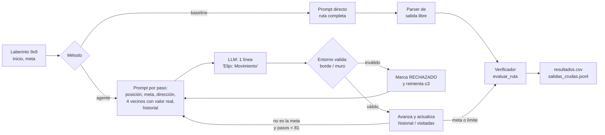

# Entregable 2
---

## 1. Qué hace este repositorio

Un modelo pequeño de pesos abiertos (**Qwen2.5-1.5B-Instruct**, ~1.5 B de parámetros) debe encontrar una ruta válida entre un punto de inicio y una meta en un laberinto de 9×9 (matriz con `0` = libre y `1` = muro).

Este repositorio compara, sobre **los mismos 20 laberintos** y con **el mismo verificador**:

| Método | Descripción |
|---|---|
| `baseline` | *Direct prompting*: el prompt del Entregable 1, que pide la ruta completa de una sola vez. |
| `agente` | **Solución**: el modelo decide **un paso a la vez**; el entorno valida cada paso y, si es inválido, lo rechaza y pide otro (hasta 3 reintentos por paso). Mantiene historial y marca celdas visitadas. |
| `agente_sin_memoria` | **Estrategia alternativa** (ablación): el mismo agente, pero sin historial ni marcas de celdas visitadas. |
| `aleatorio` | **Control**: política aleatoria sobre celdas libres, en el mismo entorno (sin modelo). |

Todo el código está en un único notebook: [`Entregable2_GenAI.ipynb`](./Entregable2_GenAI.ipynb).

---

## 2. Continuidad con el Entregable 1

**Tarea:** dado un laberinto 9×9, un inicio y una meta, producir una ruta válida.

**Falla diagnosticada:** al pedir la ruta completa con un prompt directo, el modelo propone celdas que son muros, saltos no adyacentes o celdas inexistentes, y declara valores de la matriz que no corresponden. `[COMPLETAR: pegar aquí la formulación exacta de la falla del Entregable 1]`

**Definición de respuesta correcta (idéntica a la del Entregable 1, aplicada a todos los métodos).** Implementada en `evaluar_ruta()`. Una ruta es correcta si, y solo si:
1. empieza en el inicio;
2. todas las celdas están dentro del rango 0–8;
3. ninguna celda es un muro;
4. cada par de celdas consecutivas es adyacente (Manhattan = 1, sin diagonales ni saltos);
5. llega a la meta.

**Relación intervención ↔ falla.** Como el modelo falla al mantener consistencia entre coordenadas, valores de la matriz y adyacencia a lo largo de una ruta larga, la intervención **descompone la tarea en pasos** y **externaliza la verificación** al entorno: en cada paso el modelo solo decide un movimiento y el entorno comprueba muro/borde/adyacencia de forma determinista.

### Desviaciones respecto al Entregable 1 (declaradas)

1. **Más laberintos.** El Entregable 1 tenía un solo laberinto (inicio `(0,0)`, meta `(0,8)`). Aquí es el laberinto 0 del conjunto; los otros 19 son del mismo formato (9×9, `0/1`), generados con semilla fija (`seed_base=2026`): laberinto perfecto con 3 muros abiertos para crear caminos alternativos, e inicio/meta aleatorios a distancia mínima de 10 pasos.
2. **El agente recibe más información por paso que el baseline.** Además del mapa completo, en cada paso recibe su posición, la meta, la dirección aproximada de la meta y los 4 movimientos posibles con el **valor real** de cada celda vecina (incluyendo muros y bordes, que **no se filtran**: evitarlos sigue siendo decisión del modelo). El baseline no recibe esta ayuda. Esto hace que la tarea sea más fácil para el agente que para el baseline, y por eso se reporta también el control aleatorio y la ablación sin memoria.
3. **Reintentos.** El agente puede reintentar un paso rechazado (hasta 3 veces); el baseline tiene una única pasada. Para medir el efecto, se reporta además `exito_estricto`: éxito **sin ninguna propuesta inválida**.

---

## 3. Modelo y hardware

| | |
|---|---|
| Modelo | `Qwen/Qwen2.5-1.5B-Instruct` (~1.5 B de parámetros) |
| Revisión fijada | `989aa7980e4cf806f80c7fef2b1adb7bc71aa306` |
| Precisión | `float16` (la T4 no soporta `bf16`) |
| Decodificación | *greedy* (`do_sample=False`) → resultados deterministas |
| Hardware | Google Colab, GPU **NVIDIA Tesla T4** `[COMPLETAR: confirmar que coincide con el hardware declarado en el Entregable 1]` |
| Software usado | `torch 2.11.0+cu128`, `transformers 5.16.1` |

**¿Por qué este modelo?** `[COMPLETAR: los otros dos candidatos del Entregable 1 y la razón de la elección (tamaño, resultados preliminares, licencia, cabe en T4 en fp16, etc.)]`

---

## 4. Pipeline



Componentes principales del notebook:

- `generar_laberinto`, `construir_dataset` — generación reproducible de laberintos.
- `bfs` — camino óptimo (solo para medir eficiencia; **el modelo nunca lo ve**).
- `evaluar_ruta` — verificador único para todos los métodos.
- `prompt_baseline`, `correr_baseline`, `parsear_ruta_libre` — baseline.
- `prompt_paso`, `validar_propuesta`, `correr_agente` — solución (y ablación con `usar_memoria=False`).
- `correr_aleatorio` — control sin modelo.
- `dibujar`, `analizar_fallo` — visualización y diagnóstico de fallas.

### Versiones del agente evaluadas y descartadas

| Versión | Idea | Resultado observado (3 laberintos de prueba) |
|---|---|---|
| v1 | Pedir la coordenada de destino directamente | El modelo copiaba su posición actual y no avanzaba (3/3). |
| v2 | Opciones con letra A–D | Avanzaba, pero con sesgo hacia la opción C y bucles. |
| v3 | v2 + dirección de la meta | El sesgo hacia C se mantuvo. |
| v4 | v3 + razonamiento corto | Identificaba bien la dirección de la meta (3/3), pero no la traducía a la letra correcta y listaba muros como libres. |
| **v5 (actual)** | Elegir el movimiento **por nombre** (Arriba/Abajo/Izquierda/Derecha), con las mismas palabras que la dirección de la meta | Versión evaluada en el conjunto completo. |

---

## 5. Resultados (N = 20 laberintos 9×9, mismas entradas para todos los métodos)

| Método | Éxito | Éxito estricto (0 inválidas) | Pasos prom. | Propuestas inválidas prom. | Tiempo prom. (s) |
|---|---|---|---|---|---|
| Baseline (direct prompting) | **0 / 20** (0 %) | 0 / 20 | 1.75 | — | 36.9 |
| Agente paso a paso | **2 / 20** (10 %) | 0 / 20 | 10.40 | 10.15 | 27.9 |
| Agente sin memoria | 0 / 20 (0 %) | 0 / 20 | 81.00 | 34.00 | 154.4 |
| Aleatorio (sin modelo) | 5 / 20 (25 %) | 5 / 20 | 75.15 | 0 | 0.0 |

Desglose de estados finales:

| Método | éxito | pisa_muro | salto_no_adyacente | propuestas_invalidas | limite_pasos |
|---|---|---|---|---|---|
| Baseline | 0 | 14 | 6 | 0 | 0 |
| Agente | 2 | 0 | 0 | 17 | 1 |
| Agente sin memoria | 0 | 0 | 0 | 0 | 20 |
| Aleatorio | 5 | 0 | 0 | 0 | 15 |

**Lectura honesta de los resultados:**

- El agente pasa de 0/20 a 2/20. Con N = 20 esta diferencia es **pequeña y no concluyente**; no la presentamos como una mejora robusta.
- El **control aleatorio (5/20) supera al agente (2/20)**. El aleatorio no es una política que un sistema real usaría (recorre hasta 81 pasos), pero indica que, en esta versión, el agente **no aprovecha de forma efectiva** la información que recibe.
- Lo que sí cambia de forma clara es **el tipo de falla**: el baseline produce rutas con muros o saltos (20/20 rutas inválidas, con ruta leída de ~1.75 pasos en promedio), mientras que el agente avanza en promedio 10.4 pasos antes de fallar y, cuando tiene éxito, lo hace con eficiencia 1.00 (pasos / óptimo).
- La **memoria importa**: sin historial ni marcas de visitadas el agente agota el límite de 81 pasos en 20/20 laberintos (bucles).
- Ningún éxito del agente fue "estricto": incluso los 2 éxitos necesitaron reintentos.

---

## 6. Caso de falla y por qué ocurre

**Laberinto 1** (semilla 2027; inicio `(0,8)`, meta `(8,5)`; óptimo 11 pasos). El agente avanza 2 pasos y luego queda bloqueado en `(2,8)`:

```
Meta hacia: Abajo | Elijo: Derecha | (2, 7) | valor: 0 | adyacente: sí   -> "Derecha está fuera del mapa"
```

La misma respuesta se repite en los 4 intentos, pese a que el prompt marca esa opción como `RECHAZADA`.

**Qué muestran los datos (17 de 20 fallos del agente son `propuestas_invalidas`):**

1. **El modelo identifica la dirección de la meta, pero elige otro movimiento.** Escribe `Meta hacia: Abajo` y en la misma línea `Elijo: Derecha`. Además, `Abajo` desde `(2,8)` es un muro y `Derecha` está fuera del mapa: la única salida válida hacia la meta es **Izquierda** (alejarse lateralmente), que el modelo nunca propone.
2. **La coordenada escrita no corresponde al movimiento elegido.** En promedio hay 0.95 casos por laberinto en que la celda declarada no coincide con el movimiento (por ejemplo, `Derecha` desde `(0,8)` acompañado de `(8,7)`). Es decir, la inconsistencia entre texto y acción del Entregable 1 persiste, ahora a escala de un paso.
3. **Con decodificación *greedy*, reintentar no cambia nada.** Como el cambio en el prompt tras un rechazo es mínimo (una marca `RECHAZADA` en una línea), el token más probable sigue siendo el mismo y el reintento repite la salida. Esto explica por qué el promedio de propuestas inválidas es alto (10.15 por laberinto) y por qué el agente agota los 3 reintentos.

*Hipótesis (no verificada con una ablación propia):* un modelo de ~1.5 B tiene dificultad para mapear "dirección de la meta" → "movimiento válido" cuando el movimiento válido exige alejarse de la meta en línea recta (callejón sin salida local). Verificarlo requeriría evaluar por separado laberintos donde el camino óptimo sea monótono hacia la meta frente a los que no.

**Limitaciones conocidas**

- El agente sigue eligiendo muros o salidas del mapa; la validación del entorno **detecta** el error pero no lo **corrige** si el modelo repite la misma respuesta.
- No hay planificación global: el modelo decide localmente, por lo que los callejones sin salida dependen por completo de la memoria de celdas visitadas.
- Conjunto pequeño (N = 20, una sola semilla base, un solo tamaño 9×9): los porcentajes tienen alta incertidumbre.
- El agente recibe ayuda del entorno (valores reales de vecinos y dirección de la meta) que el baseline no tiene; la comparación es entre "sistema con andamiaje" y "prompt directo", no entre dos usos del modelo con la misma información.
- El tiempo por laberinto es alto (≈28 s en promedio; 150+ s sin memoria) por generar un paso por llamada.

---

## 7. Cómo reproducir

### Opción A — Google Colab (recomendada; es lo que se muestra en el video)

1. Abrir `Entregable2_GenAI.ipynb` en [Google Colab](https://colab.research.google.com/) (*File → Open notebook → GitHub*, pegando la URL de este repo).
2. *Entorno de ejecución → Cambiar tipo de entorno de ejecución → **GPU T4***.
3. Ejecutar las celdas **en orden**:

| Sección del notebook | Qué hace |
|---|---|
| 0. Guardar en Drive | Monta Google Drive; los resultados se guardan en `MyDrive/GenIA_Entregable2`. |
| 1. Cargar el modelo | Descarga `Qwen/Qwen2.5-1.5B-Instruct` en la revisión fijada y define `generar()`. |
| 2–6. Laberintos, verificador, baseline, agente, control | Definen las funciones (no producen salida pesada). |
| 7. Prueba rápida | 3 laberintos: confirma que todo funciona y permite revisar la salida cruda del baseline. |
| 8. Evaluación completa | Ejecuta los 4 métodos sobre N = 20 laberintos. **Es la celda más larga**; guarda cada resultado apenas termina y **retoma donde quedó** si Colab se desconecta (vuelva a ejecutar las secciones 0–6 y luego la 8). |
| 9. Resumen | Reproduce las tablas de la sección 5. |
| 10. Caso de falla | Re-ejecuta paso a paso el primer laberinto donde el agente falla (determinista). |
| 11. Demo | Laberinto nuevo con **semilla aleatoria impresa** (no elegido a mano); muestra baseline y agente sobre la misma entrada. |

Para repetir exactamente la demo del video, fije en la sección 11 `seed_demo = <semilla mostrada en el video>` en lugar de `randint`.

### Opción B — Local

Requiere una GPU NVIDIA con CUDA (~4 GB de VRAM libres en fp16).

```bash
python -m venv .venv && source .venv/bin/activate
pip install torch transformers accelerate huggingface_hub pandas jupyter
jupyter notebook Entregable2_GenAI.ipynb
```

Fuera de Colab el notebook guarda los resultados en `resultados_entregable2/`. Se omite automáticamente el montaje de Drive.

### Determinismo

La decodificación es *greedy* y los laberintos usan semillas fijas (`2026 + id`), por lo que con el mismo modelo, revisión y versiones de librerías los estados finales deben coincidir con los de la sección 5. Pequeñas diferencias numéricas entre GPUs o versiones de `transformers`/`torch` podrían cambiar algunas salidas; las versiones usadas están en la sección 3.

---

## 8. Estructura del repositorio

```
.
├── Entregable2_GenAI.ipynb      # Todo el pipeline: datos, baseline, agente, control, evaluación
├── README.md
├── resultados/                  # Copiar aquí desde Drive tras correr la sección 8
│   ├── resultados.csv           # 1 fila por (laberinto, método)
│   ├── salidas_crudas.jsonl     # Rutas y texto crudo del modelo por (laberinto, método)
│   └── laberintos_9x9.json      # Los 20 laberintos con inicio y meta
└── informe/
    └── entregable2.pdf          # PDF de 1 página compilado desde LaTeX (+ .tex)
```

`resultados.csv` y `salidas_crudas.jsonl` permiten vincular cada número de la tabla con una ejecución concreta del código.

---

## 9. Qué se muestra en el video

1. Celda de carga del modelo (nombre, revisión y GPU impresos).
2. Sección 11: laberinto con semilla aleatoria impresa → **baseline** y **agente** sobre la misma entrada, con el veredicto del verificador para cada uno.
3. Sección 9: tabla de resultados sobre N = 20 (baseline vs. agente vs. ablación vs. aleatorio).
4. Sección 10: caso de falla (laberinto 1) y su explicación.
